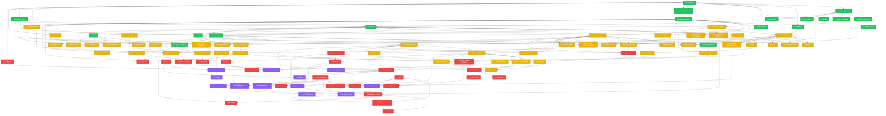

# .NET/C# — Граф зависимостей

```mermaid
graph TD
    %% ===== C# FUNDAMENTALS =====
    TS[01: Type System] --> VR[02: Value vs Reference]
    VR --> MSH[03: Memory: Stack & Heap]
    MSH --> GC[04: Garbage Collector]
    VR --> SI[05: Strings & Immutability]
    TS --> EX[06: Exceptions]
    VR --> NRT[07: Nullable]
    TS --> ExtM["Extension Methods"]
    IA --> ExtM
    TS --> PatM["Pattern Matching"]
    VR --> PatM
    VR --> RecS["Records & Structs"]
    TS --> RecS

    %% ===== OOP & LANGUAGE =====
    TS --> IP[08: Inheritance & Polymorphism]
    IP --> IA[09: Interfaces & Abstract]
    TS --> GEN[10: Generics]
    IA --> GEN
    TS --> DE[11: Delegates & Events]
    DE --> LINQ[12: LINQ]
    GEN --> LINQ
    LINQ --> ET[13: Expression Trees]
    DE --> ET
    TS --> REF[14: Reflection]
    GEN --> REF
    GEN --> ItrY["Iterators & yield"]
    IA --> ItrY
    GEN --> CovC["Covariance & Contravariance"]
    IA --> CovC

    %% ===== COLLECTIONS =====
    GEN --> AL[15: Arrays & Lists]
    AL --> DH[16: Dictionary & HashSet]
    VR --> DH
    DH --> CC[17: Concurrent Collections]
    MSH --> SM[18: Span & Memory]
    AL --> SM
    GEN --> CUST[19: Custom Collections]
    IA --> CUST
    AL --> ImmC["Immutable Collections"]
    CC --> ImmC
    AL --> SQPq["Stack, Queue & PriorityQueue"]
    GEN --> SQPq

    %% ===== ASYNC & MULTITHREADING =====
    MSH --> TTP[20: Threads & ThreadPool]
    DE --> TTP
    TTP --> TAA[21: Task & async/await]
    EX --> TAA
    TTP --> SP[22: Synchronization Primitives]
    TTP --> CC
    TAA --> PAR[23: Parallel & PLINQ]
    LINQ --> PAR
    TAA --> CH[24: Channels]
    TAA --> CP[25: Cancellation Patterns]
    TAA --> AsStr["Async Streams (IAsyncEnumerable)"]
    GEN --> AsStr
    TAA --> VTask["ValueTask"]

    %% ===== ASP.NET CORE =====
    DE --> MW[26: Middleware Pipeline]
    TAA --> MW
    IA --> DI[27: Dependency Injection]
    GEN --> DI
    MW --> RC[28: Routing & Controllers]
    MW --> AA[29: Auth & Authorization]
    RC --> AA
    RC --> FMB[30: Filters & Model Binding]
    RC --> MAPI[31: Minimal API]
    DI --> MAPI
    TAA --> SG[32: SignalR & gRPC]
    MW --> SG
    DI --> HttpClients["HTTP Clients & IHttpClientFactory"]
    TAA --> HttpClients
    DI --> ConfO["Configuration & Options"]
    DI --> LogS["Logging & Structured Logs"]
    MW --> LogS
    DI --> BgSvc["Background Services"]
    TAA --> BgSvc
    MW --> HlthC["Health Checks"]
    DI --> HlthC
    RC --> ApiV["API Versioning"]
    MAPI --> ApiV

    %% ===== DATA ACCESS =====
    LINQ --> EFB[33: EF Core Basics]
    DI --> EFB
    EFB --> EFA[34: EF Core Advanced]
    ET --> EFA
    TAA --> DAP[35: Dapper]
    EFB --> SQLO[36: SQL Optimization]
    EFA --> MIG[37: Migrations Strategies]
    TAA --> NOSQL[38: NoSQL: Redis & MongoDB]
    SQLO --> NOSQL

    %% ===== DESIGN PATTERNS =====
    IA --> CR[39: Creational Patterns]
    DI --> CR
    IA --> STR[40: Structural Patterns]
    GEN --> STR
    DE --> BEH[41: Behavioral Patterns]
    IA --> BEH
    CR --> PIN[42: Patterns in .NET]
    STR --> PIN
    BEH --> PIN
    BEH --> ConcP["Concurrency Patterns"]
    TAA --> ConcP

    %% ===== ARCHITECTURE =====
    IA --> SOLID[43: SOLID]
    PIN --> SOLID
    SOLID --> CA[44: Clean Architecture]
    DI --> CA
    CA --> DDD[45: DDD]
    DDD --> CQRS[46: CQRS & Event Sourcing]
    DDD --> MS[47: Microservices]
    DDD --> MM[48: Modular Monolith]
    CA --> MM
    CA --> HEX[49: Hexagonal]
    SOLID --> HEX
    CQRS --> SagaP["Saga Pattern"]
    MQ --> SagaP
    EFA --> OutbP["Outbox Pattern"]
    MQ --> OutbP

    %% ===== SYSTEM DESIGN =====
    CA --> SDF[50: SD Fundamentals]
    TAA --> MQ[51: Messaging & Queues]
    SDF --> MQ
    NOSQL --> CACHE[52: Caching Strategies]
    SDF --> CACHE
    RC --> APID[53: API Design]
    SDF --> APID
    MQ --> CQRS
    MS --> MQ
    SDF --> LBS[54: Load Balancing & Scaling]
    SQLO --> DSR[55: DB Sharding & Replication]
    SDF --> DSR
    LBS --> RWS[56: Real-World Systems]
    DSR --> RWS
    CACHE --> RWS
    SDF --> CapTh["CAP Theorem"]
    HttpClients --> CBRe["Circuit Breaker & Resilience"]
    SDF --> CBRe

    %% ===== TESTING =====
    DI --> UT[57: Unit Testing]
    IA --> UT
    UT --> IT[58: Integration Testing]
    EFB --> IT
    UT --> MOCK[59: Mocking Strategies]
    IA --> MOCK
    UT --> TDD[60: TDD & BDD]
    MOCK --> TDD
    IT --> LT[61: Load Testing]

    %% ===== DEVOPS =====
    MW --> DOCK[62: Docker & Containers]
    DOCK --> CICD[63: CI/CD]
    UT --> CICD
    DOCK --> K8S[64: Kubernetes]
    K8S --> MON[65: Monitoring & Logging]
    MW --> MON
    K8S --> CLOUD[66: Cloud: Azure & AWS]
    CICD --> CLOUD
    K8S --> LBS
    DOCK --> MS

    %% ===== ALGORITHMS =====
    BIG[67: Big O] --> SS[68: Sorting & Searching]
    AL --> SS
    BIG --> TG[69: Trees & Graphs]
    GEN --> TG
    BIG --> DP[70: Dynamic Programming]
    TG --> CIP[71: Interview Problems]
    DP --> CIP
    BIG --> StrAlg["String Algorithms"]
    AL --> StrAlg
    BIG --> GrAlg["Greedy Algorithms"]

    %% ===== SECURITY =====
    RC --> OW[72: OWASP Top 10]
    AA --> OW
    TS --> CRYPT[73: Cryptography]
    AA --> AUTH[74: Auth Patterns]
    OW --> AUTH
    OW --> SC[75: Secure Coding]
    AA --> DProt["Data Protection API"]
    CRYPT --> DProt
    DI --> SecMgt["Secret Management"]
    ConfO --> SecMgt

    %% ===== LEADERSHIP =====
    SOLID --> CRC[76: Code Review Culture]
    PIN --> CRC
    CA --> TD[77: Technical Decisions]
    SDF --> TD
    CRC --> MENT[78: Mentoring]
    MS --> AR[79: Architecture Review]
    MM --> AR

    %% ===== STYLING =====
    classDef junior fill:#22c55e,stroke:#16a34a,color:#fff
    classDef middle fill:#eab308,stroke:#ca8a04,color:#fff
    classDef senior fill:#ef4444,stroke:#dc2626,color:#fff
    classDef architect fill:#8b5cf6,stroke:#7c3aed,color:#fff

    class TS,VR,MSH,GC,SI,EX,NRT,IP,IA,GEN,DE,LINQ,AL,DH,BIG,SS,ExtM,PatM,RecS junior
    class ET,REF,CC,SM,CUST,TTP,TAA,SP,PAR,CH,CP,MW,DI,RC,AA,FMB,MAPI,SG,HttpClients,EFB,EFA,DAP,SQLO,CR,STR,BEH,PIN,ConcP,UT,IT,MOCK,TG,DP,CIP,ItrY,CovC,ImmC,SQPq,AsStr,VTask,ConfO,LogS,BgSvc,HlthC,ApiV,StrAlg,GrAlg middle
    class SOLID,CA,DDD,CQRS,SDF,MQ,CACHE,APID,MIG,NOSQL,TDD,LT,DOCK,CICD,K8S,OW,CRYPT,AUTH,SC,SagaP,OutbP,CapTh,CBRe,DProt,SecMgt senior
    class MS,MM,HEX,LBS,DSR,RWS,MON,CLOUD,CRC,TD,MENT,AR architect
```
