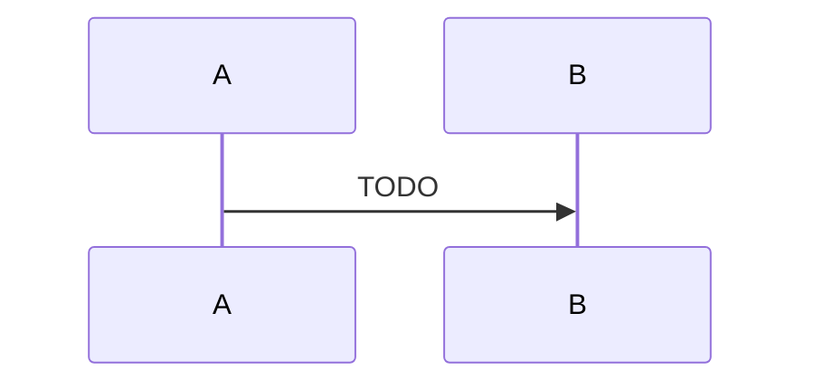

# Trees & Graphs — Схемы и диаграммы

## Концептуальная схема
```
<!-- ASCII-диаграмма -->
```

## Sequence Diagram

```mermaid
sequenceDiagram
    participant A
    participant B
    A->>B: TODO
```

## Компонентная диаграмма
<!-- архитектурная схема -->
